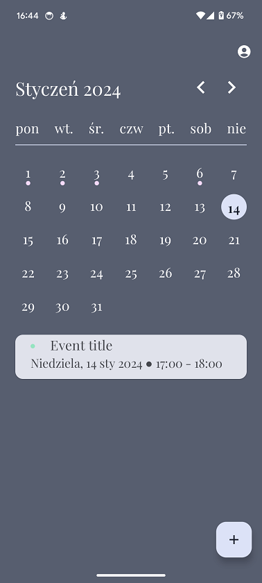

# CalendarApp

<b>Android application for showing, adding, editing and deleting calendar events. To manage events I am using Calendar Content Provider provided by Android system. 
App has four themes, one for every season. This app support different screen sizes by changing the size of text, paddings and icons based on the screen width.
Currently app is under development and user can only see the welcome screen, screen with calendar permissions and screen with events for specific day.</b>

### Table of contents
* [How to build and run the app](#how-to-build-and-run-the-app)
* [Supported Android versions](#supported-android-versions)
* [Tech stack](#tech-stack)
* [Architecture and modularization](#architecture-and-modularization)
* [App design](#app-design)

### How to build and run the app

To build and start the app on the device you need build the app in the Android Studio. Make sure you have installed Java 17 on your device.

### Supported Android versions

Application is available for devices with at least Android 11 version.

### Tech stack

* Kotlin
* UI - [Jetpack Compose](https://developer.android.com/jetpack/compose?gclsrc=ds&gclsrc=ds)
* UI design - [Material Design 3](https://m3.material.io/)
* Asynchronous tasks - [Coroutines](https://kotlinlang.org/docs/coroutines-overview.html) and [Kotlin Flow](https://kotlinlang.org/docs/flow.html)
* Dependency Injection - [Hilt](https://developer.android.com/training/dependency-injection/hilt-android)
* Content Provider - [Calendar Content Provider](https://developer.android.com/guide/topics/providers/calendar-provider)
* Logging - [Timber](https://github.com/JakeWharton/timber)
* Animations - [Lottie Animations](https://airbnb.design/lottie/)

### Architecture and modularization

CalendarApp is created based on the MVI architecture, repository and use-case patterns. Every view model needs to implement:

* uiState -> StateFlow variable that is responsible for showing current data in the screen;
* uiEvent -> SharedFlow variable that is responsible for emitting one time events like errors or navigation;
* userAction -> method that takes UserAction as the argument. This method handles every user action, for example button click action.

Modules:

* common - Common code shared between all modules;
* data - module with repositories;
* domain - module for use cases;
* uicomponents - module for components used in the app;
* designsystem - module for theme setup for calendar app;
* app - main module with every screen implementation.

### App design

